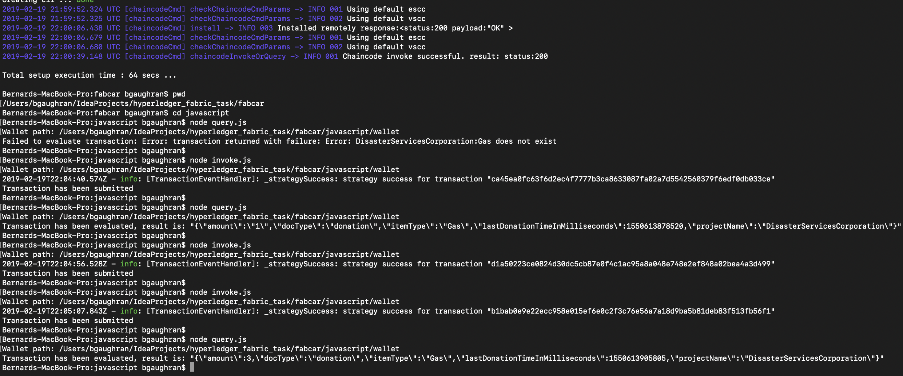
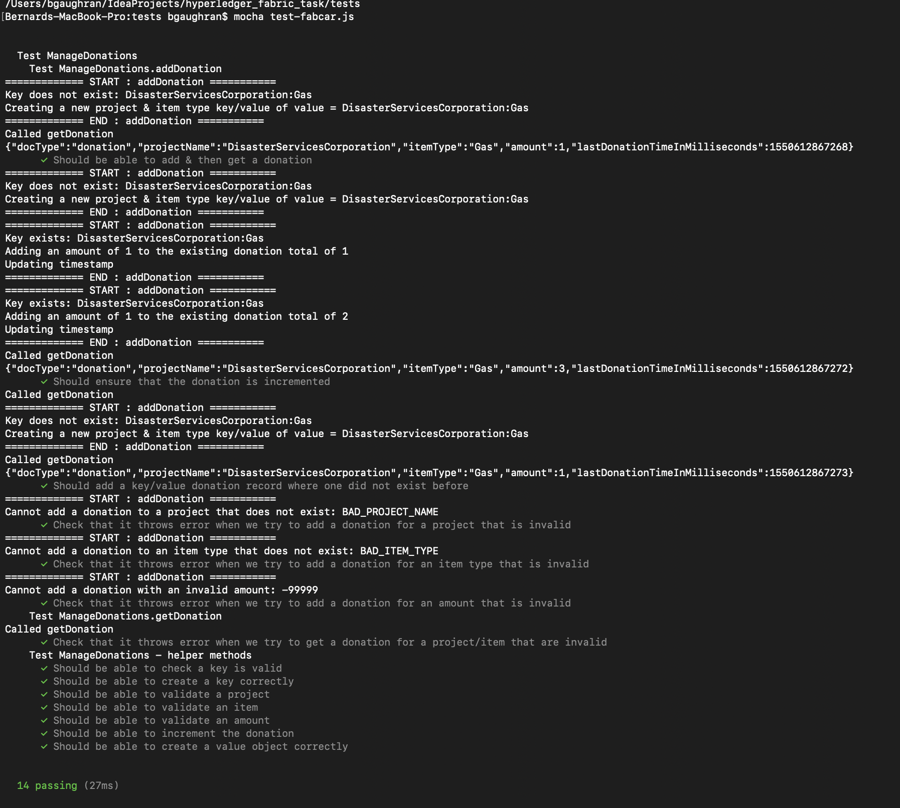

你好！
很冒昧用这样的方式来和你沟通，如有打扰请忽略我的提交哈。我是光年实验室（gnlab.com）的HR，在招Golang开发工程师，我们是一个技术型团队，技术氛围非常好。全职和兼职都可以，不过最好是全职，工作地点杭州。
我们公司是做流量增长的，Golang负责开发SAAS平台的应用，我们做的很多应用是全新的，工作非常有挑战也很有意思，是国内很多大厂的顾问。
如果有兴趣的话加我微信：13515810775  ，也可以访问 https://gnlab.com/，联系客服转发给HR。
# Hyperledger Fabric task details

```
Write an Hyperledger Fabric Chaincode to manage donations to be spent on a particular item.

Each transaction should include:
- Project Name
- Item Type
- Amount
- Timestamp

Chaincode should include the following functionality:
- `AddDonation(ProjectName, ItemType, Amount)`: to add a donation to a project. This should verify that ProjectName and ItemType actually exist.

Extra1: Add Documentation

Extra2: Add Unit tests

Write the Chaincode in NodeJS or GO.

Prepare a demo to show the chaincode running on Local Docker environment via CLI or Fabric SDK.
    
Your code deployment should be tracked on a public git repository on GitHub, and should include sufficient documentation/instructions to replicate. 

Follow good GIT practice to separate the development of each unit test.
```

## Solution
I have completed all aspects of the task, including the 2 extras. The chaincode is written in NodeJS.
The main Chaincode for review resides in the following files
- `chaincode/fabcar/javascript/lib/fabcar.js`

**Please note - I decided early into this task to focus on showing that I could write the Chaincode & effective unit tests.
To get my local environment and chaincode up and running as quickly as possible, I simply re-reused the name of one of the
provided HyperLedger examples called `fabcar.js`. The saved me time trying to figure out how to how the plumbing worked
for writing a new piece of chaincode**

The unit tests for review are found here:
- `tests/test-fabcar.js`

The demo code for review is found here (and uses the Fabric SDK):
- `fabcar/javascript/query.js`
- `fabcar/javascript/invoke.js`

Information to run the unit tests and the demo pay be found in this guide

## Documentation
The documentation can be found in this guide. Also the chaincode & unit tests have some inline comments

## Getting Started
These instructions will get you  the project up and running on your local machine for demo & testing purposes. Check out the code and follow the instructions below

### Prerequisites - Things you need to install the HyperLedger Fabric environment

- install homebrew and check version using `brew -v`
- install cURL: `brew install curl` and check version using `curl -V`
- install Docker Community Edition (download from website) and check version using `docker -v` and `docker-compose -v` (Docker Compose comes with Docker)
- install Go: `brew install curl` and check version using `go version` and explicitly set 2 environment variables ($GOPATH and the 'bin' folder of your $GOPATH folder is in included in your $PATH):
    - `export GOPATH=$HOME/go`
    - `export PATH=$PATH:$GOPATH/bin`
    - check correct using `echo $GOPATH` and `echo $PATH`
- install NodeJS: `brew install node` and check version using `node -v` and confirm npm (comes with it) is installed `npm -v`
- install HyperLedger Fabric samples and binaries:
    - `cd ~/Desktop/` 
    - start Docker (in Mac, its simply a case of running the app)
    - `curl -sSL http://bit.ly/2ysbOFE | bash -s 1.4.0` (which will install them onto your desktop in a folder called 'fabric-samples', with the main binaries in your 'bin' folder)
    - *as at 12/02/2019*, one of the npm dependencies requires CommandLineTools installed on Mac (ref https://github.com/nodejs/node-gyp/issues/569)
        - `xcode-select --install` Install Command Line Tools if you haven't already.
        - `sudo xcode-select --switch /Library/Developer/CommandLineTools` Enable command line tools
- Deploying the network
    - `cd first-network`
    - run `./first-network/byfn.sh -h` script to show options on how to do this
    - run `./byfn.sh generate` to generate certs and the genesis block  in order to set up the network, the channel and the identities on the network where we will be making the transactions
    - run  `./byfn.sh up` will run the HyperLedger network (and set up some sample transactions)
    - note: run `./byfn.sh down` brings down the network and clears up the identities/peers and certificates. It also removes the `crypto-config` directory

### Installing the chaincode
- Note: Check docker is running on your machine
- `docker rm -f $(docker ps -aq)` - checks you have no active/stale Docker containers running
- `docker network prune` - clears any cached networks
- `docker rmi dev-peer0.org1.example.com-fabcar-1.0-5c906e402ed29f20260ae42283216aa75549c571e2e380f3615826365d8269ba` - clears out old chaincode
- `cd ../fabcar`
- `./startFabric.sh`- starts our Blockchain network and installs and instantiates a NodeJS version of the FabCar smart contract which will be used by our application to access the ledger
- `npm install` (in directory with package.json)
- `npm install grpc@1.14.2`  (in directory with package.json)
- `docker logs -f ca.example.com` - this creates a log of our Certificate authority example (logs requests and responses to the cert authority)
- `cd javascript`
- `node enrollAdmin.js` - creates the admin user that can create users that can interact with the ledger. Note: it creates a directory called ‘wallet/admin’ with the user, public & private key. Every time we send a transaction to the ledger, the keys here will be used to sign those transactions to be considered valid on the blockchain. Once signed, the info will be sent to the chaincode, the chaincode will sign it with the correct info and then the Ledger will accept the transaction
- `node registerUser.js` - registers a user (once you have created the admin) who can interact with the ledger. Note: it updates the ‘wallet/admin’  with the new user and public/private keys

### Running the demo (shows how to get the chaincode running on the local Docker environment via Fabric SDK.)
- open a terminal to tail the logs of the chaincode installed in your docker image
    `docker ps` shows thew docker instances. Choose the ID running your chaincode, eg: `af7cd027a5f2`
    `docker logs af7cd027a5f -f` will tail the logs
- run `node query.js` to show an empty ledger at the start
- run `node invoke.js` to add a donation
- run `node query.js` to show the updated ledger
- run `node invoke.js` to add a 2nd donation donation
- run `node query.js` to show the updated donation for the same project and item type and updated timestamp
- see screen print below for evidence of the demo being ran....


## Unit tests
The chain code has FULL code coverage with effective unit tests :)

To ensure I could write unit tests of the 'addDonation' function in the chaincode, I used a Mock implementation of the 
fabric-shim stub [from this GitHub repository](https://github.com/wearetheledger/fabric-mock-stub) called ChaincodeMockStub.

 - Note 1: I could not find anything native within HyperLedger Fabric to provide a mock of 'fabric-shim'
 
 - **Note 2: unfortunately, due to what appears to be a small compatability issue, to get the tests to run,
 you have to make a minor modification to the chaincode source. I suspect this is due to a compatibility issue with the Mock code libraries.
 Once the following changes are made, the tests run correctly:**
     -      Replace all 4 instances of the source code from `ctx.stub` to `ctx` to ensure the tests run successfully. 
 **Obviously, this would not be acceptable in a 'real' development situation and another
 solution would be required. One thing to explore is making a small change to the `ChaincodeMockStub` source:**

### Installing the unit tests dependencies
- `npm install --global mocha` installs Mocha framework for running unit tests
- `npm install --global chai` installs Chai framework for running unit tests assertions
- `brew install yarn` installs yarn for ChaincodeMockStub dependency
- `cd tests` & run `yarn add @theledger/fabric-mock-stub --dev` installs the ChaincodeMockStub dependency. Note: install this in the directory running the tests

### Running the unit tests
- run `mocha tests/test-fabcar.js`. Output of my tests can be seen here...


## Future improvements to chaincode
- in the chaincode, as an improvement, it might be useful in the future to use the `createCompositeKey` function
 to allow each the `project` & `itemType` to be independently searchable
- To get my local environment and chaincode up and running as quickly as possible, I simply re-reused the name of one of the
  provided HyperLedger examples called `fabcar.js`. The saved me time trying to figure out how to how the plumbing worked
  for writing a new piece of chaincode. An improvement would be to name this correctly and install this in its own well named directories
  
## Future improvements to unit test
- for all 4 tests of the 'throws' clause, figure out why the expected `Throw` was not catchable by the test framework
- fix the need to change the source code (slightly!) to get the unit tests to run!

## Assumptions
- for simplicity, I have assumed that project names refer to the organisation that the donation relates to, eg: `Irish Red Cross`

## Built With
* Homebrew 2.0.2
* curl 7.54.0
* Docker version 18.09.0, build 4d60db4
* go version go1.11.5 darwin/amd64
* node v8.15.0
* HyperLedger Fabric 1.4.0

